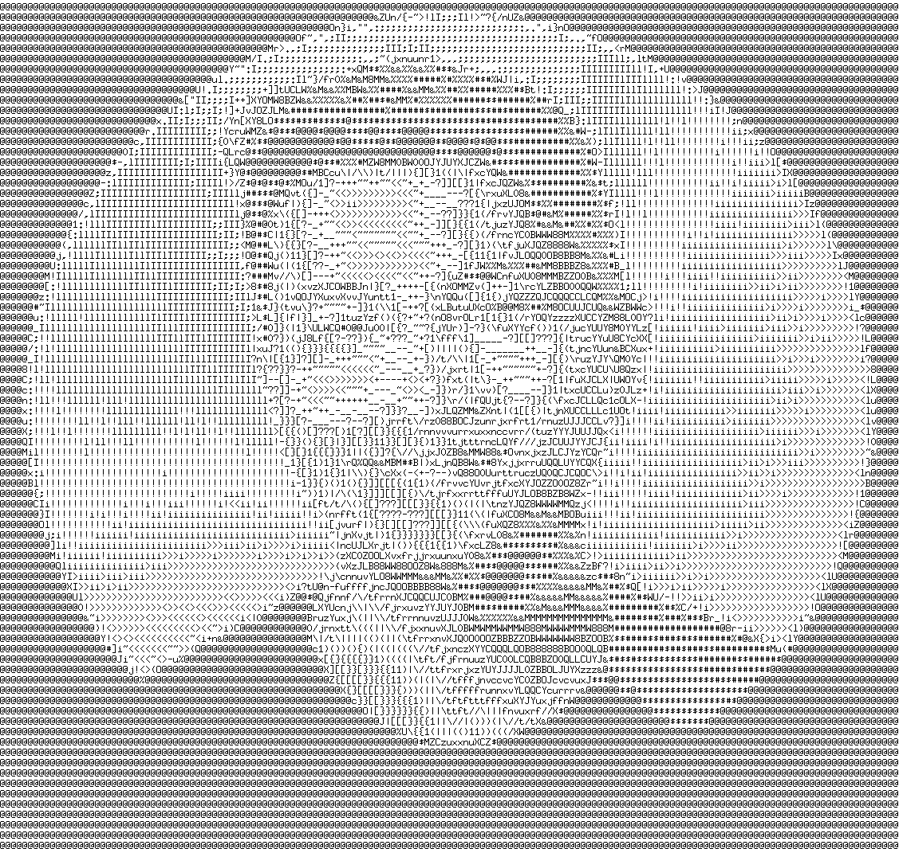

# 🖼️ ASCII Image Generator

A fun little experiment turning images into ASCII art using Go — built during a vibe-coding session with ChatGPT. 🎨💻 Please do not hate me for this. It was out of pure curiosity.

Input:


Output:



---

## ✨ What is this?

This CLI tool takes any image and generates an **ASCII-art version as a PNG** — where each pixel (or a group of them) is replaced with a character that reflects its brightness level.

It started as a spontaneous coding experiment, pairing Go's raw power with ChatGPT's help, just for the vibes.

---

## 🛠️ Features

- ✅ Accepts JPEG, PNG, and GIF input formats
- ✅ Auto-resizes images while preserving aspect ratio (max 164x164)
- ✅ Replaces bright backgrounds with neutral gray for better contrast
- ✅ Converts image pixels to ASCII characters based on brightness
- ✅ Renders the ASCII result onto a new image (PNG)
- ✅ Auto-generates filenames to avoid overwriting
- ✅ Saves results under an `output/` folder

---

## 📦 Dependencies

- [`github.com/nfnt/resize`](https://github.com/nfnt/resize) – for image resizing
- Go's standard `image` libraries
- `golang.org/x/image/font` – for rendering ASCII characters into PNG

## 🚀 Getting Started

```bash
# Clone the project
git clone git@github.com:esthapit1996/ASCII-Img-Gen.git

# Build
go build -o ascii-gen main.go

# Run
./ascii-gen path/to/image.jpg
```
You can also copy the Binary into your `PATH`  :)

## 🎁 Output

Output will be saved in a folder called `output` and the file name gets the prefix `ascii-` and suffix starting from `-1` and increments when the same image is processed instead of replacing.
